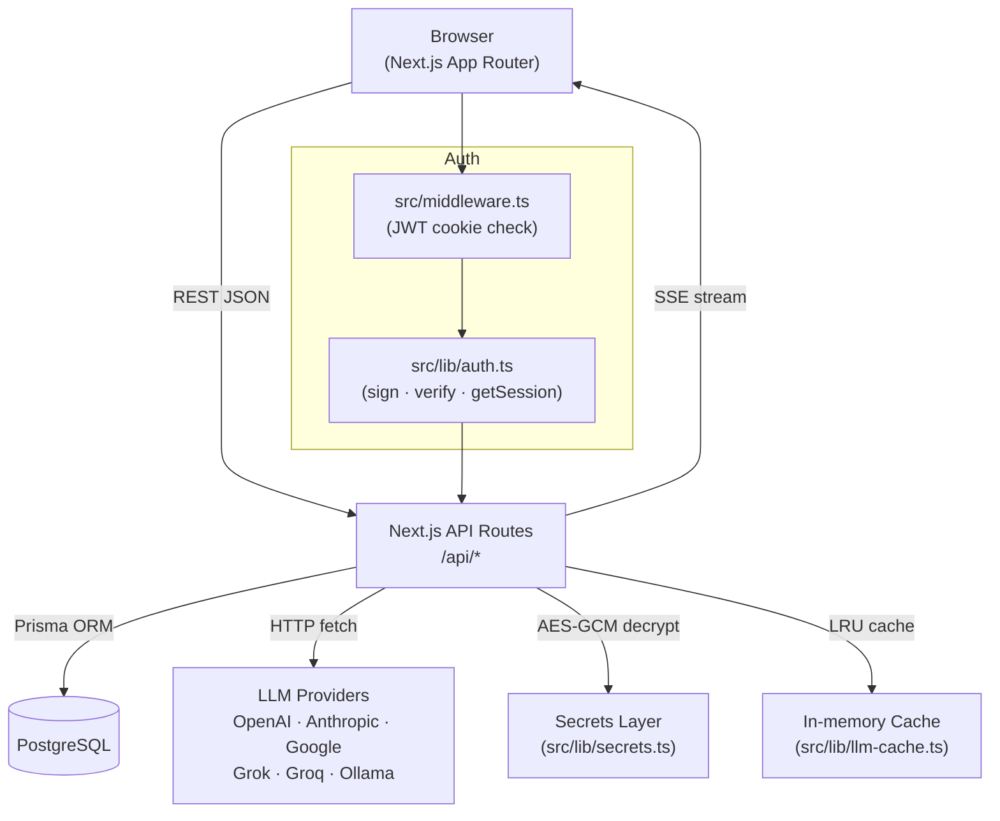

# Contributing to Xase OS

Thank you for your interest in contributing! This guide covers everything you need to go from zero to a merged PR.

---

## Architecture



### Key modules

| Module | Path | Purpose |
|--------|------|---------|
| `logger` | `src/lib/logger.ts` | Structured Pino logger — use instead of `console.*` |
| `validation` | `src/lib/validation.ts` | Zod schemas + `parseBody` helper for all API routes |
| `auth` | `src/lib/auth.ts` | JWT signing, verification, `getSession()` |
| `db` | `src/lib/db.ts` | Singleton Prisma client |
| `llm` | `src/lib/llm.ts` | `callLLM()` — dispatches to all providers |
| `secrets` | `src/lib/secrets.ts` | AES-GCM encrypt/decrypt for stored API keys |
| `rate-limit` | `src/lib/rate-limit.ts` | In-memory LRU rate limiter |
| `llm-cache` | `src/lib/llm-cache.ts` | Hash-based response cache (DB-backed) |

---

## Development Setup

```bash
git clone https://github.com/tonipcv/xaseos.git
cd xaseos
cp .env.example .env          # fill in DATABASE_URL, JWT_SECRET, ENCRYPTION_KEY
npm install
node scripts/migrate.js       # idempotent SQL migrations (never prisma migrate)
npx prisma generate
node scripts/seed.js          # creates admin@xase.ai / admin123
npm run dev                   # http://localhost:3002
```

### Running tests

```bash
npm run test              # unit tests (Vitest)
npm run test:coverage     # with coverage report → coverage/
npm run test:e2e          # Playwright E2E (requires running server)
npm run typecheck         # TypeScript strict check
npm run lint              # ESLint
```

---

## Branch & Commit Conventions

| Branch | Purpose |
|--------|---------|
| `main` | Production-ready code |
| `develop` | Integration branch — target for PRs |
| `feat/<name>` | New feature |
| `fix/<name>` | Bug fix |
| `chore/<name>` | Tooling, deps, docs |

Commit messages follow [Conventional Commits](https://www.conventionalcommits.org/):

```
feat: add playground history sidebar
fix: correct token count on Groq responses
chore: update Prisma to 5.22
docs: improve CONTRIBUTING architecture diagram
```

---

## Code Style

- **TypeScript strict mode** — no `any`; use `unknown` + type guards when needed
- **Zod validation** on every API route — use `parseBody(req, Schema)` from `src/lib/validation.ts`
- **Pino logger** everywhere — `import { createRouteLogger } from '@/lib/logger'`; never `console.*`
- **Tailwind CSS** only — use the approved palette (see `tailwind.config.ts`)
  - Forbidden: `zinc-*`, `gray-*`, `neutral-*`, `slate-*`, `emerald-*`
  - Approved: `sand-*`, `warmgray-*`, `slateblue-*`

---

## Adding a New API Route

1. Create `src/app/api/<resource>/route.ts`
2. Import `parseBody` and define a Zod schema in `src/lib/validation.ts`
3. Use `createRouteLogger` for structured logging
4. Add the route to the OpenAPI spec in `src/app/api/openapi.json/route.ts`
5. Write tests in `route.test.ts` alongside the route
6. Add the route to the README API table

---

## Database Changes

> ⚠️ **`prisma migrate` is strictly forbidden.** All schema changes must be written as raw SQL.

1. Add idempotent SQL to `scripts/migrate.sql`:
   ```sql
   ALTER TABLE tasks ADD COLUMN IF NOT EXISTS priority TEXT DEFAULT 'medium';
   ```
2. Apply: `node scripts/migrate.js`
3. Update `prisma/schema.prisma` to match
4. Regenerate client: `npx prisma generate`
5. Verify build: `npm run build`

Never use `DROP`, `TRUNCATE`, or destructive statements without explicit instruction.

---

## Pull Request Process

1. Fork → branch off `develop`
2. Make your changes with tests
3. Ensure CI passes locally:
   ```bash
   npm run lint && npm run typecheck && npm run test && npm run build
   ```
4. Open a PR against `develop` using the PR template
5. A maintainer will review within 48 hours

---

## Reporting Issues

Use the [bug report template](.github/ISSUE_TEMPLATE/bug_report.yml) and include:
- Steps to reproduce
- Expected vs actual behaviour
- Node / browser version and setup (Docker / local)

---

## License

By contributing you agree your code will be released under the [MIT License](./LICENSE).
